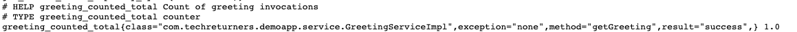

# Code Telemetry

## Introduction

In this exercise, you are going to take the concept of observability and add telemetry to your existing applications.

Specifically, you'll add telemetry to the Java spring boot application and also the Python books API to expose information about how the applications are performing.

For your reference, the Java application was created in the **ce-cicd-sample-java-app** exercise and the Python books API was created in the **ce-kubernetes-multiple-apps**

Also do not worry if you haven't experienced either Python or Java, this might feel uncomfortable - having to work with code and understand languages/frameworks that you are yet to use.

This is part of a cloud engineer's role, understanding an application codebase and identifying how it could be instrumented in order to better educate the team that created the application.

## Prometheus client libraries

Prometheus has client libraries that can be added as dependencies to your code. You can find the listing of client libraries on the page below

[Prometheus client libraries](https://prometheus.io/docs/instrumenting/clientlibs/)

Then there are specific wrappers around those client libraries applicable to the applications being created

* For **Java**, the application is a Spring Boot application and [Micrometer](https://micrometer.io/) provides observability tools that can work with Prometheus

* For **Python**, the application is a Python Flask API and the [Prometheus Flask Exporter](https://pypi.org/project/prometheus-flask-exporter/) provides observability tools that can work with Prometheus

## Instructions

Your goal is to instrument the Java and Python application.

Once instrumented you should be able to start the applications, using Docker, and view the metrics being exposed by them.

To view the metrics you should be able to:

* Visit [http://localhost:8080/actuator/prometheus](http://localhost:8080/actuator/prometheus) on the Java application and see the list of metrics
* Visit [http://localhost:5000/metrics](http://localhost:5000/metrics) on the Python application

At a minimum your instrumentation should have:

* The Java app should count how many times the `getGreeting` method is called within the `GreetingServiceImpl`
* The Java app should time how long the `greeting` method in the `GreetingController` takes
* The Python app should count how many times the `get` method for getting the list of books is called

## How do I know I am finished?

This is perhaps the unwhelming part but roll with it because you will use this telemetry later in the programme and visualise it in a more interesting fashion.

You should be able to visit the metrics pages listed in the previous section and see you custom metrics. 

For example here is a sample from the Java metrics exposed. It shows a custom metric called `greeting_counted_total`

## Submission process

1. Apply the telemetry to your Java application repository, commit and push

2. Apply the telemetry to your Python books API repository, commit and push

3. Complete the [SOLUTION.md](./SOLUTION.md) in this repository

4. Share the GitHub links to your Java application repository, your Python repository and this repository.

## Further reading

[Micrometer observability for Java](https://micrometer.io/)

[Micrometer and Spring Boot](https://mehmetozkaya.medium.com/monitor-spring-boot-custom-metrics-with-micrometer-and-prometheus-using-docker-62798123c714)

[Counted annotation stack overflow post](https://stackoverflow.com/questions/70975346/springboot-micrometer-metrics-not-showing-up)

[Prometheus Flask Exporter](https://pypi.org/project/prometheus-flask-exporter/)

